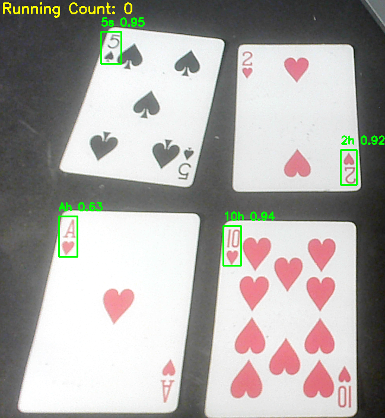

# Blackjack Card Counter

A real-time **blackjack card counter** that uses computer vision to detect cards and track a Hi-Lo running count for **single-deck blackjack**.

---

## Demo Snapshot

The demo shows the system detecting four cards in real-time:

- **5♠ (5 of Spades)**
- **2♥ (2 of Hearts)**
- **A♥ (Ace of Hearts)**
- **10♥ (10 of Hearts)**

The YOLOv8 model draws bounding boxes around each card and labels them with the detected rank. The Ace detection is a little inconsistent, so sometimes it may misclassify or flicker in labeling.

---

## How It Works

1. **Webcam Feed** – The system processes live frames from a camera.  
2. **Card Detection** – YOLOv8 identifies each visible playing card.  
3. **Classification** – Each card is recognized for its rank.  
4. **Hi-Lo Mapping** – Ranks are converted into the Hi-Lo counting values:
   - 2–6 → +1  
   - 7–9 → 0  
   - 10, J, Q, K, A → -1  
5. **Running Count Update** – The system maintains a real-time running count.  
6. **Duplicate Filtering** – Logic prevents counting the same card multiple times in the same frame.

---

## Hi-Lo Count Example (Demo Frame)

For the demo frame cards:

| Card | Hi-Lo Value |
|------|-------------|
| 5♠   | +1          |
| 2♥   | +1          |
| A♥   | -1          |
| 10♥  | -1          |

**Net Running Count:**  
\[
+1 + 1 - 1 - 1 = 0
\]

So the deck is statistically neutral at this moment.

---

## Notes

- Ace detection may be inconsistent in some frames.  
- Designed specifically for **single-deck blackjack**; multi-deck counting logic is not implemented.  
- Demo shows detection accuracy with cards: 5♠, 2♥, A♥, 10♥.
